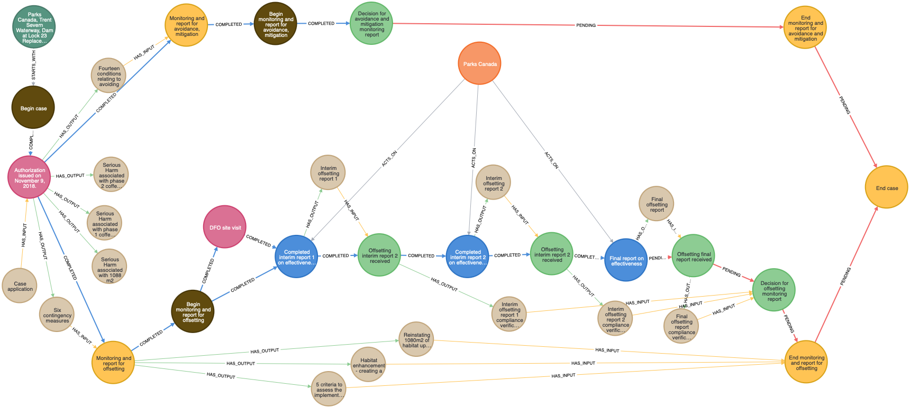
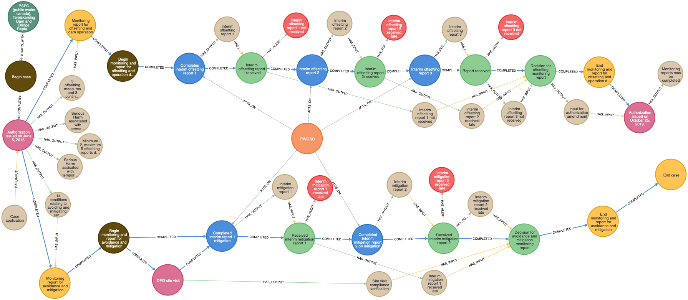

# feasible-path
Consulting advisor on data and process modelling for Program Activity Tracking for Habitat (PATH)

## The Project

### *Background*

Fisheries and Oceans Canada (DFO) through the Fish and Fish Habitat Protection Program (FFHPP) manages physical threats to fish and fish habitat and aquatic species at risk. DFO reviews proposals for work near water to determine whether they are likely to result in the death of fish or the harmful alteration, disruption or destruction (HADD) of fish habitat. DFO also reviews projects to determine whether they will adversely impact listed species at risk and contravene sections 32, 33 or 58 of the Species at Risk Act (SARA).  All information related to project reviews is entered into the Departmental database PATH (Program Activity Tracking for Habitat).

Detailed project information either entered or uploaded into the PATH is not currently searchable using existing database search functions. Analysis of the information is required to support program work planning essential for aligning program delivery activities with Departmental priorities and work objectives.

Currently the only means to retrieve this information is to search each file activity list (consisting of 10’s to hundreds of entries) relies on experienced individual users to identify or remember linkages between relevant documents. Due the large number of applications now within PATH, the time required to do this searching and connecting is significant, resulting in a significant backlog of reviews and high potential for ambiguity and human error. Furthermore, this siloed working process makes it hard for integration of further activities, responding to system failure, and/or knowledge transfer and/or analysis.

### *Objective*

The objective is to evaluate the feasibility of automating the application of PATH domain knowledge of current working process using network science and supervised machine learning. This evaluation will be used to develop a strategy for future work that will empower decision-makers through automatic aggregation of existing data resources into a connected data graph, visual representation of decision making process, and suggesting recommendations.

Core to this exercise is establishing and characterizing case studies consisting of a concrete set of extracted information, step-by-step flow diagram depicting involved process, contextualization with domain-specific knowledge, decision making logic, and desirable outcomes. Using a set of defined case-studies, this work will classify existing authorization processes into distinct classes, describe in detail the technical process for automation, and define requirements for supervised machine learning of existing and future domain knowledge.

Click for details!

### *Statement of Work*

i. Understand and identify database information searching problem

1. Identify a set of 5 focused PATH searches that exemplify typical day-to-day operations and critical pain-points for their business needs.
2. Propose a method for observing and recording the step-by-step process taken to achieve these searches.
3. Propose and execute a method to track the query process.

ii. Track and characterize the process and data involved 

1. Observe and record in detail the processes and data used to execute above searches
2. Characterize the types of data and processes observed during the search 
3. Develop a conceptual process model showing how data types are linked in complete a search
4. Extract sample data objects sufficient to demonstrate the data types and processes

iii. Propose a next viable project 

Develop a proposal for a larger-scale project aimed at mining PATH data and making it operational within the scope of:
1. RR daily business needs and
2. Data extraction for potential research into cumulative effects.

iv. Support/Collaboration

This project will be supported at several levels within DFO:
1. Neil Fisher within regulatory review will provide support on defining the use-cases and walking through the PATH authorization processes that need to be automated.
2. Tom Bird (ecosystem science) will provide technical bridging between RR and the technical advisor, as well as development of scoping for next steps. 

### *Deliverables*
- Written report on the outcome of the exercise and the feasibility of a follow-on project.
- Diagram of the conceptual model developed. 

## First Case study

Here's the PATH case.

 

### Data extraction and transformation into a graph-based process

**Case**

The `Parks Canada, Trent Severn Waterway, Dam at Lock 23 Replacement` case is defined as an entity described in the table below and is represented as a neo4j node with the same properties.

| identification | title                                                           | category | start_state  |
|----------------|-----------------------------------------------------------------|----------|--------------|
| case-1         | Parks Canada, Trent Severn Waterway, Dam at Lock 23 Replacement | Medium   | begin-case-1 |

**Process**

The states of the case as a process are represented as a list of rows in the table below. Each state has 12 properties:
- identification: the (global) unique identification of the state
- type: one of the following types:
    + ACTION: an internal action by the case (process) controller
    + INPUT: action by an external party resulted in one or several input items (documents, datasets, etc)
    + DECISION: an evaluation resulted in a decision what next state to be chosen
    + BEGIN/END (for process control), PROCESS - indicate a sub process with a BEGIN/END
- title: the short title of each state
- date: the date (timestamp) when the state is created
- event: the date when a reminder to be sent to notify users about this state
- actors: who are interact with the state
- input_items: items (document, datasets, etc) to be considered by this state
- output_items: items (document, datasets, etc) to be produced/altered by this state
- route: identification of state that follows the current statae by default
- route_completed: indicate if this route is already completed
- alternate_routes: different states that can also be reached from the current state
- alternate_routes_completed: indicate if these route are already completed

[This is the Excel spreadsheet that can be used to define further cases](import/feasible-path.xlsx).    

| identification                    | type     | title                                                    | date        | event       | actors       | input_items                                                                                  | output_items                                                                                                                                                                                                                                                                                                                                                                                                                  | route                             | route_completed | alternate_routes  | alternate_routes_completed |
|-----------------------------------|----------|----------------------------------------------------------|-------------|-------------|--------------|----------------------------------------------------------------------------------------------|-------------------------------------------------------------------------------------------------------------------------------------------------------------------------------------------------------------------------------------------------------------------------------------------------------------------------------------------------------------------------------------------------------------------------------|-----------------------------------|:---------------:|-------------------|:--------------------------:|
| begin-case-1                      | BEGIN    | Begin case                                               |             |             |              |                                                                                              |                                                                                                                                                                                                                                                                                                                                                                                                                               | authorization-issuance-case-1     |        Y        |                   |                            |
| authorization-issuance-case-1     | ACTION   | Authorization issued on November 9, 2018.                | 2018-11 -09 |             |              | Case application                                                                             | Serious Harm associated with phase 1 cofferdam footprint and dewatering – 2417 m2 November 1, 2018 to July 15, 2019\|Serious Harm associated with phase 2 cofferdam footprint and dewatering – 1867 m2 July 15, 2019 to July 15 2020\| Serious Harm associated with 1088 m2 of infill associated with moving the dam downstream\|Fourteen conditions relating to avoiding and mitigating serious harm\|6 contingency measures | monitoring-report-process-case-1  |        Y        |                   |                            |
| monitoring-report-process-case-1  | PROCESS  | Monitoring and report for avoidance and mitigation       | 2018-11 -09 |             |              |                                                                                              |                                                                                                                                                                                                                                                                                                                                                                                                                               | begin-monitoring-report-case-1    |        Y        |                   |                            |
| begin-monitoring-report-case-1    | BEGIN    | Begin monitoring and report for avoidance and mitigation | 2018-11 -09 |             |              | Fourteen conditions relating to avoiding and mitigating serious harm\|6 contingency measures | Habitat enhancement - creating a Walleye spawning shoal (760m2) at an offsite location\| Reinstating 1080m2 of habitat upstream of the dam\| 5 criteria to assess the implementation and effectiveness of the measures                                                                                                                                                                                                        | report-1-case-1                   |        Y        | site-visit-case-1 |              Y             |
| site-visit-case-1                 | ACTION   | DFO site visit                                           | 2019-10 -29 |             |              |                                                                                              |                                                                                                                                                                                                                                                                                                                                                                                                                               | report-1-case-1                   |        Y        |                   |                            |
| report-1-case-1                   | INPUT    | Interim report 1 on effectiveness                        |             | 2019-12 -31 | Parks Canada |                                                                                              | Interim report 1                                                                                                                                                                                                                                                                                                                                                                                                              | receive-report-1-case-1           |        Y        |                   |                            |
| receive-report-1-case-1           | DECISION | Report received                                          | 2019-11 -29 | 2019-11 -29 |              | Interim report 1                                                                             | Verified interim report 1                                                                                                                                                                                                                                                                                                                                                                                                     | report-2-case-1                   |        Y        |                   |                            |
| report-2-case-1                   | INPUT    | Interim report 2 on effectiveness                        |             | 2020-12 -31 | Parks Canada |                                                                                              | Interim report 2                                                                                                                                                                                                                                                                                                                                                                                                              | receive-report-2-case-1           |        Y        |                   |                            |
| receive-report-2-case-1           | DECISION | Report received                                          | 2020-12 -22 | 2020-12 -22 |              | Interim report 2                                                                             | Verified interim report 2                                                                                                                                                                                                                                                                                                                                                                                                     | report-3-case-1                   |        Y        |                   |                            |
| report-3-case-1                   | INPUT    | Final report  on effectiveness                           |             | 2021-12 -31 | Parks Canada |                                                                                              |                                                                                                                                                                                                                                                                                                                                                                                                                               | decision-monitoring-report-case-1 |        N        |                   |                            |
| decision-monitoring-report-case-1 | DECISION | Decision for monitoring report                           |             |             |              | All monitoring reports                                                                       | All verified monitoring reports                                                                                                                                                                                                                                                                                                                                                                                               | end-monitoring-report-case-1      |        N        |                   |                            |
| end-monitoring-report-case-1      | END      | End monitoring and report for avoidance and mitigation   | 2018-11 -09 |             |              |                                                                                              |                                                                                                                                                                                                                                                                                                                                                                                                                               | end-case-1                        |        N        |                   |                            |
| end-case-1                        | END      | End case                                                 | 2018-11 -09 |             |              |                                                                                              |                                                                                                                                                                                                                                                                                                                                                                                                                               |                                   |                 |                   |                            |

### Data visualization

Here's the case transformed into a graph:

 

## Second Case study

### Data extraction and transformation into a graph-based process

**Case**

The `PSPC (Public Works Canada), Temiskaming Dam and Bridge Replacement` case is defined as an entity described in the table below and is represented as a neo4j node with the same properties.

| identification | title                                                              | category | start_state  |
|----------------|--------------------------------------------------------------------|----------|--------------|
| case-2         | PSPC (Public Works Canada), Temiskaming Dam and Bridge Replacement | Medium   | begin-case-2 |

**Process**

| identification                               | type     | title                                                        | date       | event      | actors | input_items                                                                                                                   | output_items                                                                                                                                                                                                                                                                                                                                              | route                                        | route_completed | alternate_routes                            | alternate_routes_completed |                   alert                   |
|----------------------------------------------|----------|--------------------------------------------------------------|------------|------------|--------|-------------------------------------------------------------------------------------------------------------------------------|-----------------------------------------------------------------------------------------------------------------------------------------------------------------------------------------------------------------------------------------------------------------------------------------------------------------------------------------------------------|----------------------------------------------|:---------------:|---------------------------------------------|:--------------------------:|:-----------------------------------------:|
| begin-case-2                                 | BEGIN    | Begin case                                                   |            |            |        |                                                                                                                               |                                                                                                                                                                                                                                                                                                                                                           | authorization-issuance-case-2                |        Y        |                                             |                            |                                           |
| authorization-issuance-case-2                | ACTION   | Authorization issued on June 5, 2015.                        | 2015-06-05 |            |        | Case application                                                                                                              | Serious Harm assicated with temportrya consturciton activitiies\|Serious Harm associated with permanent habitat loss due to new footprint Downstream (1088m2)\|Minimum 2, maximum 5 offsetting reports depending on the interim reports\|14 conditions relating to avoiding and mitigating serious harm\|3 offsetting measures and 3 contingency measures | monitoring-report-mitigation-process-case-2  |        Y        | monitoring-report-offsetting-process-case-2 |              Y             |                                           |
| monitoring-report-mitigation-process-case-2  | PROCESS  | Monitoring report for avoidance and mitigation               | 2015-06-05 |            |        | 14 conditions relating to avoiding and mitigating serious harm                                                                |                                                                                                                                                                                                                                                                                                                                                           | begin-monitoring-mitigation-report-case-2    |        Y        |                                             |                            |                                           |
| begin-monitoring-mitigation-report-case-2    | BEGIN    | Begin monitoring and report for avoidance and mitigation     | 2015-06-05 |            |        |                                                                                                                               |                                                                                                                                                                                                                                                                                                                                                           | site-visit-case-2                            |        Y        | mitigation-report-1-case-2                  |              Y             |                                           |
| site-visit-case-2                            | ACTION   | DFO site visit                                               | 2017-10-26 |            |        |                                                                                                                               | Site visit compliance verification                                                                                                                                                                                                                                                                                                                        | mitigation-report-1-case-2                   |        Y        |                                             |                            |                                           |
| mitigation-report-1-case-2                   | INPUT    | Completed interim report 1 mitigation                        |            | 2016-01-31 | PWGSC  |                                                                                                                               | Interim mitigation report 1                                                                                                                                                                                                                                                                                                                               | receive-mitigation-report-1-case-2           |        Y        |                                             |                            |                                           |
| receive-mitigation-report-1-case-2           | DECISION | Received interim mitigation report 1                         | 2016-03-29 |            |        | Interim mitigation report 1                                                                                                   | Interim mitigation report 1 received late                                                                                                                                                                                                                                                                                                                 | mitigation-report-2-case-2                   |        Y        |                                             |                            | Interim mitigation report 1 received late |
| mitigation-report-2-case-2                   | INPUT    | Completed interim mitigation report 2 on mitigation          |            | 2017-01-31 | PWGSC  |                                                                                                                               | Interim mitigation report 2                                                                                                                                                                                                                                                                                                                               | receive-mitigation-report-2-case-2           |        Y        |                                             |                            |                                           |
| receive-mitigation-report-2-case-2           | DECISION | Received interim mitigation report 2                         | 2017-04-06 |            |        | Interim mitigation report 2                                                                                                   | Interim mitigation report 2 received late                                                                                                                                                                                                                                                                                                                 | decision-monitoring-mitigation-report-case-2 |        Y        |                                             |                            | Interim mitigation report 2 received late |
| decision-monitoring-mitigation-report-case-2 | DECISION | Decision for avoidance and mitigation monitoring report      |            |            |        | Site visit compliance verification\|Interim mitigation report 1 received late\|Interim mitigation report 2 received late      |                                                                                                                                                                                                                                                                                                                                                           | end-monitoring-mitigation-report-case-2      |        Y        |                                             |                            |                                           |
| end-monitoring-mitigation-report-case-2      | END      | End monitoring and report for avoidance and mitigation       | 2018-11-09 | 2017-03-15 |        |                                                                                                                               |                                                                                                                                                                                                                                                                                                                                                           | end-case-2                                   |        Y        |                                             |                            |                                           |
| monitoring-report-offsetting-process-case-2  | PROCESS  | Monitoring report for offsetting and dam operation           | 2015-06-05 |            |        | 3 offsetting measures and 3 contingency measures                                                                              |                                                                                                                                                                                                                                                                                                                                                           | begin-monitoring-offsetting-report-case-2    |        Y        |                                             |                            |                                           |
| begin-monitoring-offsetting-report-case-2    | BEGIN    | Begin monitoring and report for offsetting and operation dam | 2015-06-05 |            |        |                                                                                                                               |                                                                                                                                                                                                                                                                                                                                                           | offsetting-report-1-case-2                   |        Y        |                                             |                            |                                           |
| offsetting-report-1-case-2                   | INPUT    | Completes interim offsetting report 1                        |            | 2016-01-31 | PWGSC  |                                                                                                                               | Interim offsetting report 1                                                                                                                                                                                                                                                                                                                               | receive-offsetting -report-1-case-2          |        Y        |                                             |                            |                                           |
| receive-offsetting -report-1-case-2          | DECISION | Interim offsetting  report 1 received                        |            |            |        | Interim offsetting report 1                                                                                                   | Interim offsetting report 1 not received                                                                                                                                                                                                                                                                                                                  | offsetting-report-2-case-2                   |        Y        |                                             |                            | Interim offsetting report 1 not received  |
| offsetting-report-2-case-2                   | INPUT    | Interim offsetting  report 2                                 |            | 2018-01-31 | PWGSC  |                                                                                                                               | Interim offsetting report 2                                                                                                                                                                                                                                                                                                                               | receive-offsetting-report-2-case-2           |        Y        |                                             |                            |                                           |
| receive-offsetting-report-2-case-2           | DECISION | Interim offsetting  report 2r eceived                        | 2018-01-26 |            |        | Interim offsetting report 2                                                                                                   | Interim offsetting report 2 received late                                                                                                                                                                                                                                                                                                                 | offsetting-report-3-case-2                   |        Y        |                                             |                            | Interim offsetting report 2 received late |
| offsetting-report-3-case-2                   | INPUT    | Interim offsetting  report 3                                 |            | 2019-01-31 | PWGSC  |                                                                                                                               | Interim offsetting report 3                                                                                                                                                                                                                                                                                                                               | receive-offsetting-report-3-case-2           |        Y        |                                             |                            |                                           |
| receive-offsetting-report-3-case-2           | DECISION | Report received                                              |            |            |        | Interim offsetting report 3                                                                                                   | Interim offsetting report 3 not received                                                                                                                                                                                                                                                                                                                  | decision-monitoring-offsetting-report-case-2 |        Y        |                                             |                            | Interim offsetting report 3 not received  |
| decision-monitoring-offsetting-report-case-2 | DECISION | Decision for offsetting monitoring report                    |            |            |        | Interim offsetting report 1 not received\|Interim offsetting report 2 received late\|Interim offsetting report 3 not received | Input for  authorization amendment                                                                                                                                                                                                                                                                                                                        | end-monitoring-offsetting-report-case-2      |        Y        |                                             |                            |                                           |
| end-monitoring-offsetting-report-case-2      | END      | End monitoring and report for offsetting and operation dam   |            | 2017-03-15 |        |                                                                                                                               |                                                                                                                                                                                                                                                                                                                                                           | authorization-amendment-case-2               |        Y        |                                             |                            |                                           |
| authorization-amendment-case-2               | ACTION   | Authorization issued on October 25, 2019.                    | 2019-10-25 |            |        | Input for  authorization amendment                                                                                            | Monitoring reports mus be completed                                                                                                                                                                                                                                                                                                                       |                                              |                 |                                             |                            |                                           |
| end-case-2                                   | END      | End case                                                     |            |            |        |                                                                                                                               |                                                                                                                                                                                                                                                                                                                                                           |                                              |                 |                                             |                            |                                           |

[This is the Excel spreadsheet that can be used to define further cases](import/feasible-path.xlsx).    

### Data visualization

Here's the case transformed into a graph:

 

## Implementation

### Data import into neo4j by Cypher query language

Here's the case imported into a neo4j database by a simple Cypher query

        :param xlsx_file => '/import/feasible-path.xlsx';
        :param sheets => ['1', '2'];

        UNWIND $sheets AS sheet
        WITH sheet
        CALL apoc.load.xls($xlsx_file, sheet + '!A1:D2')
            YIELD map
        WITH sheet, map
        MERGE (case:CASE {uid: map.identification})
            SET
            case.title = map.title,
            case.category = map.category,
            case.start_state = map.start_state

        WITH sheet, case
        CALL apoc.load.xls($xlsx_file, sheet + '!A4:M27')
            YIELD map
        WITH sheet, case, map
        MERGE (state:STATE {uid: map.identification})
        WITH sheet, case, state, map  
        CALL apoc.create.addLabels(state, [map.type]) YIELD node
        WITH sheet, case, state, map
        SET
            state.title = map.title,
            state.date = DATE(map.date),
            state.event = DATE(map.event),
            state.output_items = map.output_items
        FOREACH (a IN SPLIT(map.actors, '|') | 
            MERGE (actor:ACTOR {uid: a + '-' + case.uid})
            SET
                actor.title = a
            MERGE (state)<-[:ACTS_ON]-(actor)
        )
        FOREACH (i IN SPLIT(map.input_items, '|') | 
            MERGE (item:ITEM {uid: i + '-' + case.uid})
            SET
                item.title = i
            MERGE (state)<-[:HAS_INPUT]-(item)
        )
        FOREACH (o IN SPLIT(map.output_items, '|') | 
            MERGE (item:ITEM {uid: o + '-' + case.uid})
            SET
                item.title = o
            MERGE (state)-[:HAS_OUTPUT]->(item)
        )
        FOREACH (a IN SPLIT(map.alert, '|') |
            MERGE (alert:ALERT {uid: a + '-' + case.uid})
            SET
                alert.title = a
            MERGE (state)-[:HAS_ALERT]->(alert)
        )

        WITH sheet, case
        CALL apoc.load.xls($xlsx_file, sheet + '!A4:M27')
            YIELD map
        WITH sheet, case, map
        MERGE (start_state:STATE {uid: case.start_state})
        MERGE (case)-[r:STARTS_WITH]->(start_state)
        WITH sheet, case, map
        MERGE (start_state:STATE {uid: map.identification})
        FOREACH (_ IN CASE WHEN map.route IS NOT NULL THEN [1] ELSE [] END |
            MERGE (end_state:STATE {uid: map.route})
            FOREACH(_ IN CASE map.route_completed = 'Y' WHEN TRUE THEN [1] ELSE [] END |
            MERGE (start_state)-[r:COMPLETED]->(end_state)
            )
            FOREACH(_ IN CASE map.route_completed = 'N' WHEN TRUE THEN [1] ELSE [] END |
            MERGE (start_state)-[r:PENDING]->(end_state)
            )
        )
        FOREACH (state_id IN SPLIT(map.alternate_routes, '|') | 
            MERGE (end_state:STATE {uid: state_id})
            FOREACH(_ IN CASE map.alternate_routes_completed = 'Y' WHEN TRUE THEN [1] ELSE [] END |
            MERGE (start_state)-[r:COMPLETED]->(end_state)
            )
            FOREACH(_ IN CASE map.alternate_routes_completed = 'N' WHEN TRUE THEN [1] ELSE [] END |
            MERGE (start_state)-[r:PENDING]->(end_state)
            )
        );

        CALL apoc.periodic.iterate(
        "
            MATCH (n:ACTION)
                WITH n, [
                    apoc.map.fromPairs([['u', 'output_items'], ['c', CASE n.output_items IS NULL WHEN TRUE THEN '' ELSE REPLACE(n.output_items, '|', '. ') END]])
                ] AS input
            RETURN n, input
        ", "
            WITH n, input
            CALL custom.nlp_import(n, 'http://nlp:8000/process/', apoc.convert.toJson(input))
            YIELD result
            RETURN 1;
        ",
        {
            batchSize:100, iterateList:true, parallel:false
        });

### How to access the graph above

- first watch this video to get familiar with neo4j brower [Getting Started with Neo4j Browser](https://neo4j.com/videos/gettingstartedbrowser4-0/)
- then open your browser, go to http://206.47.13.10:7474, login with username `neo4j`, password `path`
- then run the following to see the whole graph:

        MATCH (n) RETURN n

***Note: do not delete anything from the graph, please***

### How to reproduce this in the cloud

*If you have only 5 mins and don't care if you want to keep it on your own machine*

- Go to create a [neo4j sandbox](https://neo4j.com/sandbox/), click on 'Launch a Free Sandbox', agree to the terms, launch a blank sandbox, click on 'Open' green button to open a browser tab to access the sandbox.
- first, copy the context of this [Cypher query](cql/step_2_custom_schema.cql), paste it into the query box, click on the blue button to run it.
- second, copy the context of this [Cypher query](cql/step_3_case_study_import.cql), paste it into the query box, click on the blue button to run it.
- then run the following to see the whole graph:

        MATCH (n) RETURN n

### How to reproduce this on your computer

*If you can deal with Docker and has admin right to your own machine*

To run it on your computer (macOS or Linux)
- install Docker Desktop (Docker & Docker Compose)
- checkout the repository:

        git clone https://github.com/nghia71/feasible-path.git
        cd feasible-path

- create and run neo4j docker:

        ./run.sh

- open your browser, go to http://localhost:7474, enter with username `neo4j`, password `path`
- first, copy the context of this [Cypher query](cql/step_2_custom_schema.cql), paste it into the query box, click on the blue button to run it.
- second, copy the context of this [Cypher query](cql/step_3_case_study_import.cql), paste it into the query box

Switch the comment 

        // :param xlsx_file => '/import/feasible-path.xlsx';
        :param xlsx_file => 'https://github.com/nghia71/feasible-path/raw/main/import/feasible-path.xlsx';

to the below in order to use local import:

        :param xlsx_file => '/import/feasible-path.xlsx';
        // :param xlsx_file => 'https://github.com/nghia71/feasible-path/raw/main/import/feasible-path.xlsx';

then click on the blue button to run it.

- then run the following to see the whole graph:

        MATCH (n) RETURN n

